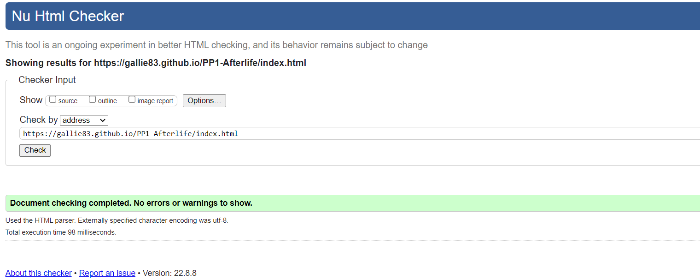
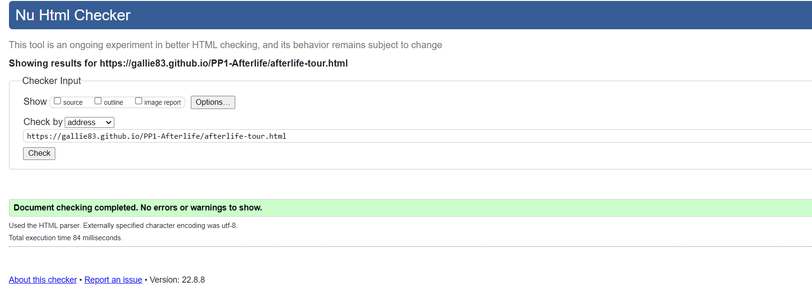
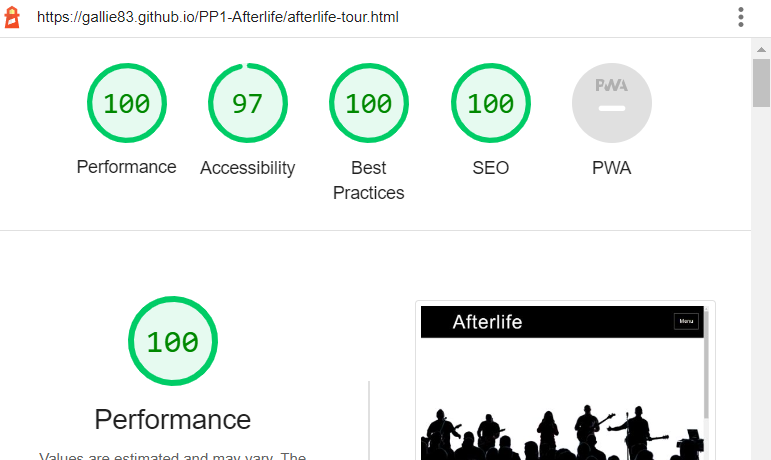

# Testing
## Code Validation
The Afterlife site has be throughly tested. All the code has been run through the [W3C html Validator](https://validator.w3.org/) and the [W3C CSS Validator](https://jigsaw.w3.org/css-validator/). Minor errors were found on the home page. After a fix and retest, no errors occured for either. 

The HTML validator results for each page are below:

* Home page

* Album page

* Tour page

* Merch page

* Contact page

The CSS validator results are below:

## Responsiveness Test

* The responsive design tests were carried out manually with [Google Chrome DevTools](https://developer.chrome.com/docs/devtools/) and [Am I Responsive](https://ui.dev/amiresponsive/).

|        | Moto G4 | Galaxy S5 | iPhone 5 | iPad | Display <1200px | Display >1200px |
|--------|---------|-----------|----------|------|-----------------|-----------------|
| Render | pass    | pass      | pass     | pass | pass            | pass            |
| Images | pass    | pass      | pass     | pass | pass            | pass            |
| Links  | pass    | pass      | pass     | pass | pass            | pass            |

Note: On wide display types the contents of the site are restricted in width to 2000px. This helps the UX by not spreading the content too wide on the extra wide screens.

## Browser Compatibility

Afterlife site was tested on the following browsers with no visible issues for the user. 
Google Chrome, Microsoft Edge and Mozilla Firefox. Responsiveness was consistent throughout for a range of device sizes.

### Lighthouse
The site was also tested using [Google Lighthouse](https://developers.google.com/web/tools/lighthouse) in Chrome Developer Tools to test each of the pages.

## Testing User Stories

* As a user I want to be able to navigate through the whole site smoothly.
    * Navigation is at the top of every page in the form of the **navigation menu**.

     
* As a user I want to easily be able to contact Afterlife for more information.
    * On the **contact** page there is a form to fill out to contact the band. There is also a mailing list on the homepage to keep up to date with the band.

     
* As a user I want to see all of Afterlife's body of work
    * In the **album** section, there is a detailed overview of all the bands albums.
    * Additionally one of the pages is the **tour** page. This has all the information on when the band will be performing around the country.
     

* As a user I want to know more about Afterlife.
    * On the home page, there is a section describing the background and general sound of the band.

     
* As a user I want to connect with Afterlife on social media.
    *On the footer, there are links to all the bands social media sites.

## Bugs
* Solved
    * There was a gap between the navbar and the pages content which I was unable to remove with padding or margin. I then changed the background color of the body to blend it in to the page so it would not be noticeable.

* Un-Solved
    * I was unable to get the buttons to open links in a seperate tab while keeping the main website tab open.
      
     

### Peer review
In addition to all the above testing the beta version of the site was shown to peers in the software development field. They were able to point out overlooked inconsistencies and slight design errors that havce since been fixed.

Back to [README.md](README.md).